# BatchSweep Analysis: methods, physical meaning, and interpretation

## 1. Introduction

This folder is a standalone, read-only post-processing layer for the four saved homogeneous EDGA reactor sweeps. It does **not** rerun the reactor model, modify `batch_simulation.py`, or write into the original `BatchSweep` result tree. Instead, it turns the already-saved `run_config.json` and `profiles.csv` files into an auditable dataset, adds physically meaningful quantities, and then applies descriptive statistical and decision-support methods.

The four studies are:

| Route | Geometry | Dimensions | Temperatures | Cases |
|---|---|---|---|---:|
| H₂SO₄ | A | 60 mm length, 4 mm ID | 25–160 °C, 8 levels | 1,000 |
| H₂SO₄ | B | 200 mm length, 18 mm ID | 25–80 °C, 4 levels | 500 |
| NaOH | A | 60 mm length, 4 mm ID | 25–160 °C, 8 levels | 1,000 |
| NaOH | B | 200 mm length, 18 mm ID | 25–80 °C, 4 levels | 500 |

Every study varies five EGDA feed concentrations, five catalyst/base feed concentrations, and five linked flow settings. The two inlet flows are always equal, so their individual effects cannot be separated. The analysis therefore uses total flow as the flow factor while retaining the individual flow columns for traceability.

The main objective is not merely to identify the largest EGMA value. It is to answer a sequence of more useful questions:

1. Were all intended simulations actually generated and loaded correctly?
2. How do geometry, mixing, kinetics, stoichiometry, equilibrium, and transport combine in each case?
3. Which swept inputs explain the observed response variation?
4. Where does EGMA reach its axial maximum, and is the outlet too early or too late?
5. Which conditions are Pareto-efficient or robust to movement to neighboring grid points?
6. Where does the ideal homogeneous PFR assumption become physically questionable?

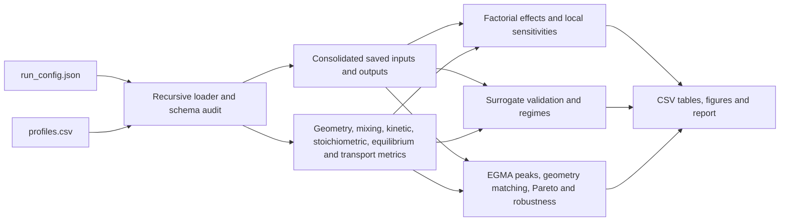

## 2. What the code in this folder does

| File or module | Responsibility |
|---|---|
| `analyze_batch_results.py` | Command-line entry point. It accepts the source result root, output directory, and optional analysis configuration. |
| `batchsweep_analysis/config.py` | Default thresholds, Pareto objectives, numerical tolerances, and robust-window definitions. |
| `batchsweep_analysis/io.py` | Recursively discovers scenarios, validates JSON/profile schemas, creates stable scenario IDs, detects duplicates, and writes deterministic CSV/JSON files. |
| `batchsweep_analysis/physics.py` | Calculates geometry, mixed-inlet, kinetic, Damköhler, throughput, stoichiometric, equilibrium, transport-validity, and axial-peak metrics. |
| `batchsweep_analysis/statistics.py` | Performs exact functional ANOVA, local finite differences, response-surface validation, Pareto dominance, robust-window testing, and geometry matching. |
| `batchsweep_analysis/plots.py` | Generates the analysis figures and a same-named CSV containing the data plotted in each figure. |
| `batchsweep_analysis/report.py` | Converts the calculated results into the narrative `analysis_report.md`. |
| `batchsweep_analysis/pipeline.py` | Orchestrates loading, calculation, statistics, CSV writing, plotting, and reporting. |
| `docs/build_readme_figures.py` | Reads the finished result CSVs and generates the static figures embedded in this README. It does not alter analysis results. |
| `tests/test_analysis.py` | Tests discovery, exclusions, duplicates, formulas, peak detection, ANOVA reconstruction, Pareto logic, geometry matching, and deterministic output. |

## 3. Core definitions used throughout the analysis

Let $C_{A,0}$ be the mixed-inlet EGDA concentration. The saved reactor responses are

$$
X_{\mathrm{EGDA}}=1-\frac{C_{\mathrm{EGDA,out}}}{C_{A,0}},\qquad
Y_i=\frac{C_{i,\mathrm{out}}-C_{i,0}}{C_{A,0}},\qquad
S_{\mathrm{EGMA}}=\frac{Y_{\mathrm{EGMA}}}{X_{\mathrm{EGDA}}}.
$$

The yields are on an ethylene-glycol-backbone basis. Consequently, EGMA yield and EG yield can be compared directly, and $S_{\mathrm{EGMA}}$ is the fraction of converted EGDA that remains at the desired mono-cleavage intermediate.

For the cylindrical reactor,

$$
A=\frac{\pi d^2}{4},\qquad V=AL,\qquad
Q=Q_1+Q_2,\qquad u=\frac{Q}{A},\qquad \tau=\frac{V}{Q}.
$$

Mixed-inlet concentrations follow the ideal flow-weighted mixing rule

$$
C_{i,\mathrm{mix}}=\frac{Q_1C_{i,1}+Q_2C_{i,2}}{Q_1+Q_2}.
$$

The kinetic exposure is summarized by

$$
k_i(T)=A_i\exp\!\left(-\frac{E_{a,i}}{RT}\right),\qquad
\kappa_i=k_i(T)C_{\mathrm{driver},0},\qquad
\mathrm{Da}_i=\kappa_i\tau.
$$

For H₂SO₄, the rate-driving concentration is the modeled inlet proton concentration and acid is not consumed. For NaOH, it is the **inlet** OH⁻ concentration; OH⁻ then decreases along the reactor. A high NaOH Damköhler number therefore describes a fast initial timescale but does not eliminate a stoichiometric OH limitation.

## 4. Running the analysis

From the repository root in PowerShell:

```powershell
& 'C:\Users\vt4ho\AppData\Local\Programs\Python\Python312\python.exe' `
  .\BatchSweep_Analysis\analyze_batch_results.py `
  --root 'C:\Users\vt4ho\Simulations\kinetics_sim\EDGA\Homogenous_RESULTS\BatchSweep' `
  --out '.\BatchSweep_Analysis\results' `
  --config '.\BatchSweep_Analysis\analysis_config.json'
```

To rebuild only the figures embedded in this README after rerunning the analysis:

```powershell
& 'C:\Users\vt4ho\AppData\Local\Programs\Python\Python312\python.exe' `
  .\BatchSweep_Analysis\docs\build_readme_figures.py
```

## 5. Result CSV guide

The following subsections explain every root CSV in `results/`: what creates it, what its columns mean physically, how it should be interpreted, and what the present data show. Each image is stored inside this repository using a relative path, so it is rendered automatically when this README is opened on GitHub.

### 5.1 `data_coverage.csv` — did the intended design load completely?

This is the first table to inspect. The loader groups scenarios by route and geometry, lists the observed factor levels, calculates the number of expected factorial cells as the product of the level counts, and compares it with the number loaded.

For geometry A, $8\times5\times5\times5=1{,}000$ cells are expected per route. For geometry B, $4\times5\times5\times5=500$ cells are expected. All four studies are complete, all flows are linked and equal, and the missing-cell count is zero. This completeness is why an exact balanced-grid functional ANOVA can be used later.

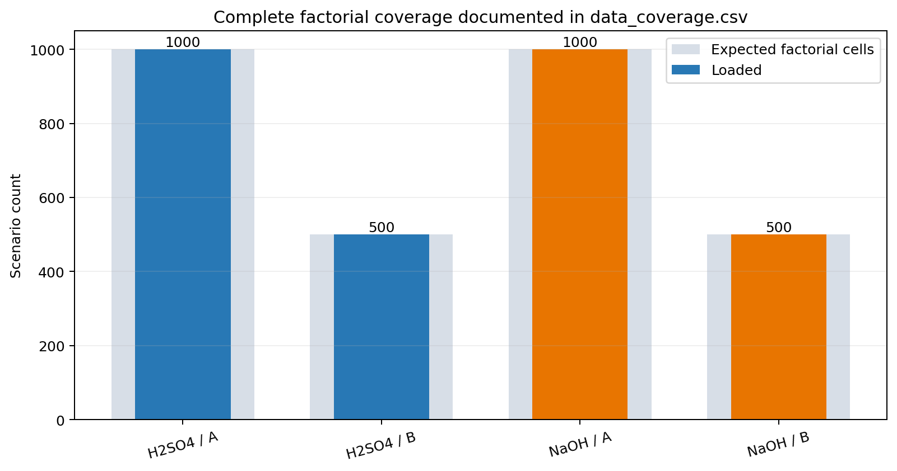

### 5.2 `duplicate_configs.csv` — are any physical configurations repeated?

Folder names are not used to decide whether two simulations are the same. The loader constructs a configuration key from catalyst, temperature, both flows, both feed concentrations, geometry, proton/Ka₂/activity settings, and reversibility. Scenarios sharing that key are reported as duplicates even if their paths differ.

The present file contains only its header because all 3,000 configurations are unique. This matters statistically: duplicate rows would otherwise give some grid cells unintended extra weight.

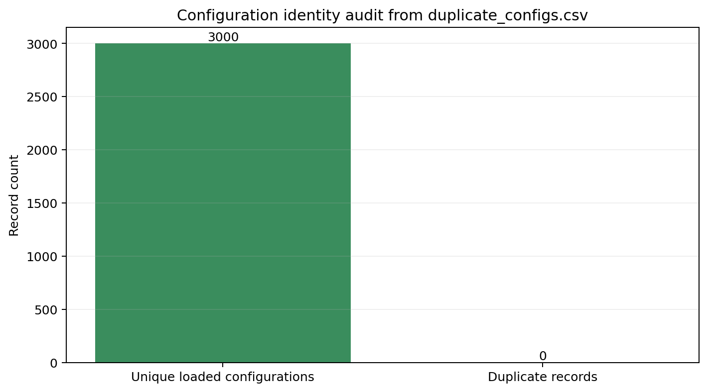

### 5.3 `consolidated_scenarios.csv` — the auditable master table of saved inputs and outputs

This table contains one row per accepted scenario. It flattens the original `run_config.json` without re-simulating anything. It includes route, geometry, temperature, stream flows, feed concentrations, densities, speciation settings, reversibility settings, residence time, conversion, yields, selectivity, kinetic timescale constants, outlet concentrations, equilibrium outputs, and numerical verification errors.

Its purpose is traceability: every statistical result can be joined back to a source directory through `scenario_id`, `relative_path`, and the absolute input paths. The image shows the actual experimental-design domain. Every bubble represents one temperature/flow cell; its area represents the 25 catalyst/EGDA concentration combinations at that cell.

The most important comparability limitation is visible immediately: geometry A extends to 160 °C, whereas geometry B stops at 80 °C. Whole-grid averages of the two geometries therefore do not isolate geometry.

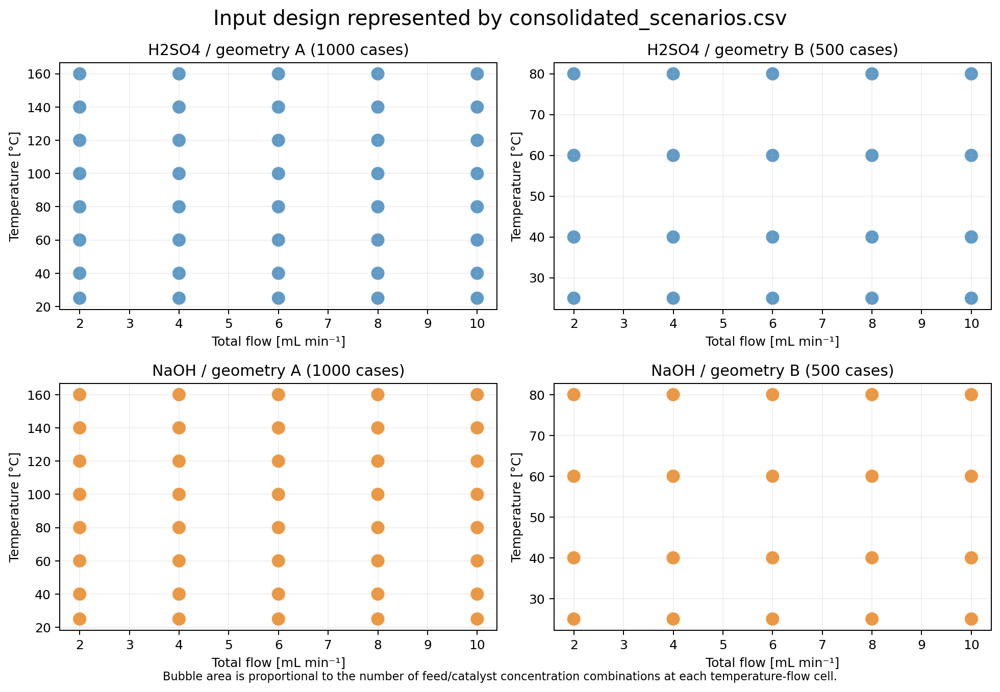

### 5.4 `derived_metrics.csv` — physical quantities calculated from every scenario

This is the main physics table. It uses the master row together with the first and last saved profile points. The following groups of quantities are calculated.

**Geometry and flow**

- Cross-sectional area, reactor volume, total flow, superficial velocity, and independently recalculated residence time.
- Geometry A has a volume of approximately 0.754 mL and residence times of 4.52–22.62 s.
- Geometry B has a volume of approximately 50.89 mL and residence times of 305–1,527 s.
- `tau_relative_error` compares the saved residence time with $V/Q$; the largest absolute discrepancy is approximately $2\times10^{-16}$, confirming internal consistency.

**Mixed-inlet state**

- Actual mixed EGDA, water, total catalyst/base, H⁺, and OH⁻ concentrations.
- Stream fractions and dilution factors. Because $Q_1=Q_2$, both feeds are diluted by a factor of 0.5 after mixing.
- Catalyst-to-EGDA and catalyst-per-acetate-group ratios.

**Kinetic exposure**

- Arrhenius $k_1$ and $k_2$, their ratio, initial pseudo-first-order constants, and $\mathrm{Da}_1$, $\mathrm{Da}_2$.
- Acid $\mathrm{Da}_1$ ranges from roughly $6\times10^{-5}$ to 2.82; the NaOH inlet $\mathrm{Da}_1$ reaches above 1,500 because saponification is much faster and geometry B has a long residence time.
- For NaOH, $R_{\mathrm{OH}}=C_{\mathrm{OH},0}/C_{\mathrm{EGDA},0}$ distinguishes kinetic exposure from reagent sufficiency.

**Throughput and productivity**

$$
\dot n_{\mathrm{EGMA}}=Q\,C_{\mathrm{EGMA,out}},\qquad
\mathrm{STY}=\frac{\dot n_{\mathrm{EGMA}}}{V}.
$$

The CSV reports molar feed/output rates, EGMA space-time yield in mol m⁻³ s⁻¹ and mol L-reactor⁻¹ h⁻¹, EGMA per catalyst/base mole, and EGMA per EGDA feed mole. Geometry A reaches much higher STY because its small volume gives high throughput per reactor volume; this does not automatically mean higher single-pass conversion.

**NaOH stoichiometry**

- Residual and utilized OH fractions.
- `EGDA_conversion_stoichiometric_ceiling = min(1, C_OH,0/C_EGDA,0)`, the maximum fraction that can undergo at least the first cleavage.
- `total_cleavage_stoichiometric_fraction = min(1, C_OH,0/(2C_EGDA,0))`, the supplied fraction of all two acetate groups.

**H₂SO₄ equilibrium proximity**

$$
\frac{Q_1}{K_1}=\frac{C_{\mathrm{EGMA}}C_{\mathrm{AcOH}}}{C_{\mathrm{EGDA}}C_{\mathrm{H_2O}}K_1},\qquad
\frac{Q_2}{K_2}=\frac{C_{\mathrm{EG}}C_{\mathrm{AcOH}}}{C_{\mathrm{EGMA}}C_{\mathrm{H_2O}}K_2}.
$$

A value near one indicates that the corresponding reversible step is near equilibrium. `X_over_Xeq` compares conversion with the separately calculated equilibrium conversion.

**Transport and validity**

$$
\mathrm{Re}=\frac{\rho ud}{\mu},\qquad
t_{\mathrm{rad}}=\frac{(d/2)^2}{D_m},\qquad
\mathrm{Bo}=\frac{uL}{D_{\mathrm{ax}}}.
$$

The code estimates temperature-dependent water density and viscosity, assigns the flow regime, compares radial diffusion time with residence time, applies Taylor–Aris diagnostics when appropriate, flags temperatures above 100 °C, and combines these with numerical checks into `physical_valid`.

The figure shows why one Damköhler number is sufficient to organize much of the acid response but not the NaOH response. Acid yield follows a relatively tight kinetic-exposure curve. NaOH branches according to $R_{\mathrm{OH}}$: at high exposure, insufficient OH or overreaction to EG can reduce EGMA yield.

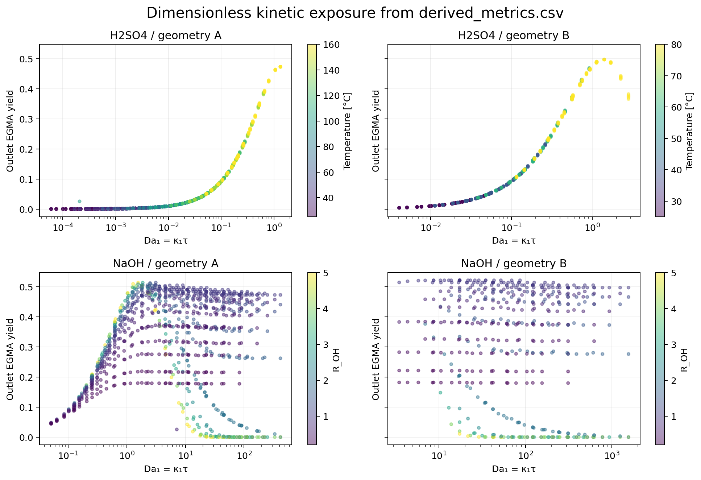

### 5.5 `excluded_or_invalid_scenarios.csv` — exclusions and retained applicability warnings

Despite the filename, this table includes two different situations:

1. A scenario that could not be loaded and was excluded.
2. A successfully loaded scenario retained with a numerical, pressure, or transport advisory.

There are zero loader exclusions. All 3,000 rows are retained advisories. Every case is classified as laminar and radially segregated under the molecular-diffusion screen. Of these, 750 cases are also above 100 °C and require pressurization under the configured screen.

This does **not** mean the ODE solutions failed. It means the simulated ideal one-dimensional PFR may not represent the real empty tube because radial diffusion is too slow compared with residence time. The model contains no bead packing, static mixer, secondary-flow correction, residence-time distribution, or mass-transfer correction.

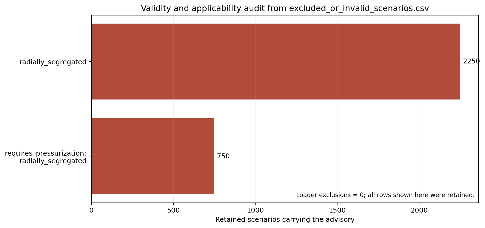

### 5.6 `main_effects.csv` — exact discrete main effects

For each route/geometry study and for each response $X_{\mathrm{EGDA}}$, $Y_{\mathrm{EGMA}}$, $S_{\mathrm{EGMA}}$, and $Y_{\mathrm{EG}}$, the balanced grid is decomposed as

$$
y=\mu+f_T+f_{C_{\mathrm{cat}}}+f_{C_{\mathrm{EGDA}}}+f_Q+\text{interactions}.
$$

For a factor level, its effect is the conditional mean response at that level minus the overall mean after lower-order terms are removed. `component_variance` is the mean squared effect over the factor levels. `contribution_fraction` divides that component by the total response variance.

These are exact descriptive properties of the chosen grid—not p-values, significance tests, or universal causal importance values.

For acid EGMA yield, temperature is dominant: 65.1% of variance in geometry A and 68.1% in B. For NaOH, the main effects are less dominant because stoichiometric interactions are strong. EGDA feed concentration contributes 33.4% in NaOH geometry B, while temperature contributes only about 0.5% over its 25–80 °C range.

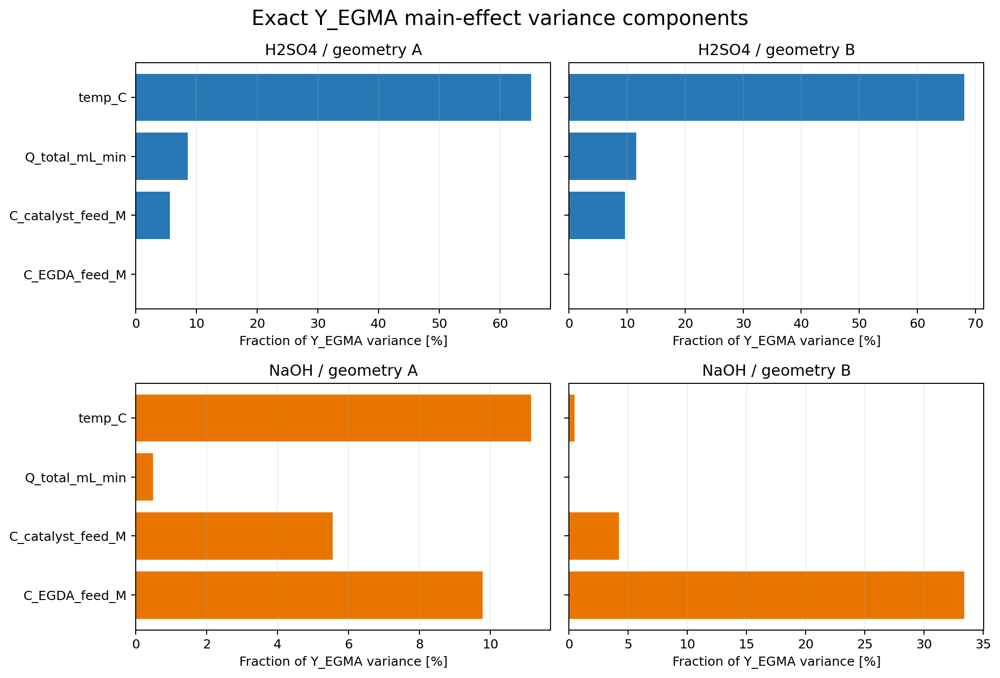

### 5.7 `interaction_effects.csv` — when one input changes the effect of another

This table stores all second-, third-, and fourth-order functional-ANOVA effects. An interaction is nonzero when the effect of one factor cannot be described independently of the other factors.

For H₂SO₄ geometry A, temperature×flow explains 11.1% of EGMA-yield variance and temperature×acid concentration explains 8.0%. This is physically consistent with exposure: temperature changes $k(T)$, flow changes $\tau$, and acid changes the rate-driving H⁺ concentration.

For NaOH, the interaction between base feed and EGDA feed is central because it changes $R_{\mathrm{OH}}$. It explains 27.2% of EGMA-yield variance in geometry A and 60.1% in geometry B. This is a clear example where examining only one-factor trends would miss the governing stoichiometric structure.

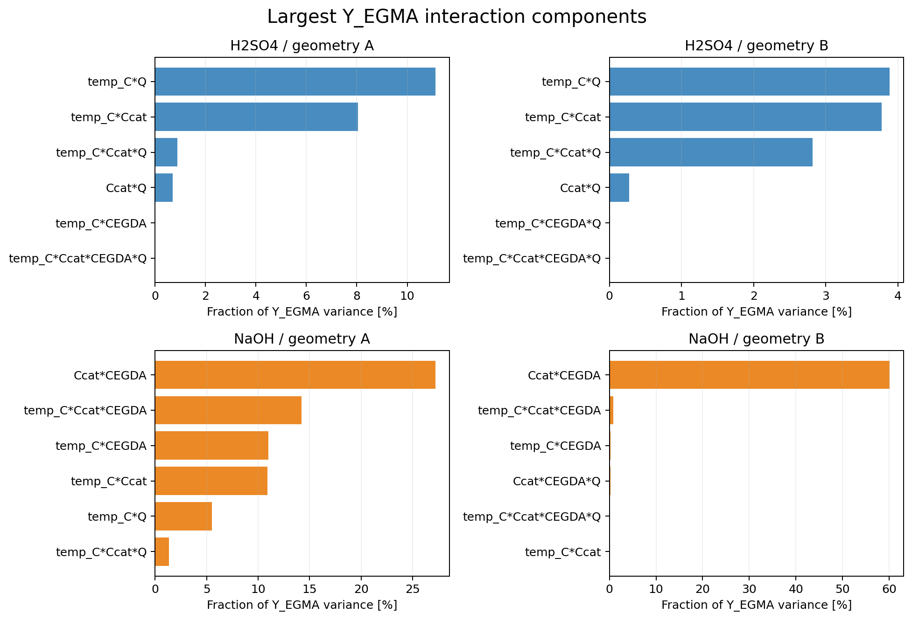

### 5.8 `local_elasticities.csv` — local slopes on the actual grid

ANOVA describes variation across the full discrete domain; local elasticity asks how steeply the response changes near a particular scenario while the other factors remain fixed.

For ordinary factors,

$$
E_x=\frac{x}{y}\frac{\partial y}{\partial x}.
$$

Finite differences are central inside the grid and one-sided at its boundaries. For temperature, the differentiation coordinate is $1/T$ rather than °C, matching the natural Arrhenius coordinate. The CSV retains the signed derivative and signed elasticity; the figure shows median absolute magnitudes so sensitivity strengths can be compared.

Acid EGMA yield has a large temperature elasticity (median magnitude 18.3 in geometry A and 13.6 in B), while its EGDA-feed elasticity is close to zero. In NaOH geometry B, flow elasticity is essentially zero because the long residence time already drives most cases to a stoichiometric or product-distribution limit. Catalyst and EGDA feed elasticities remain important because together they set OH availability.

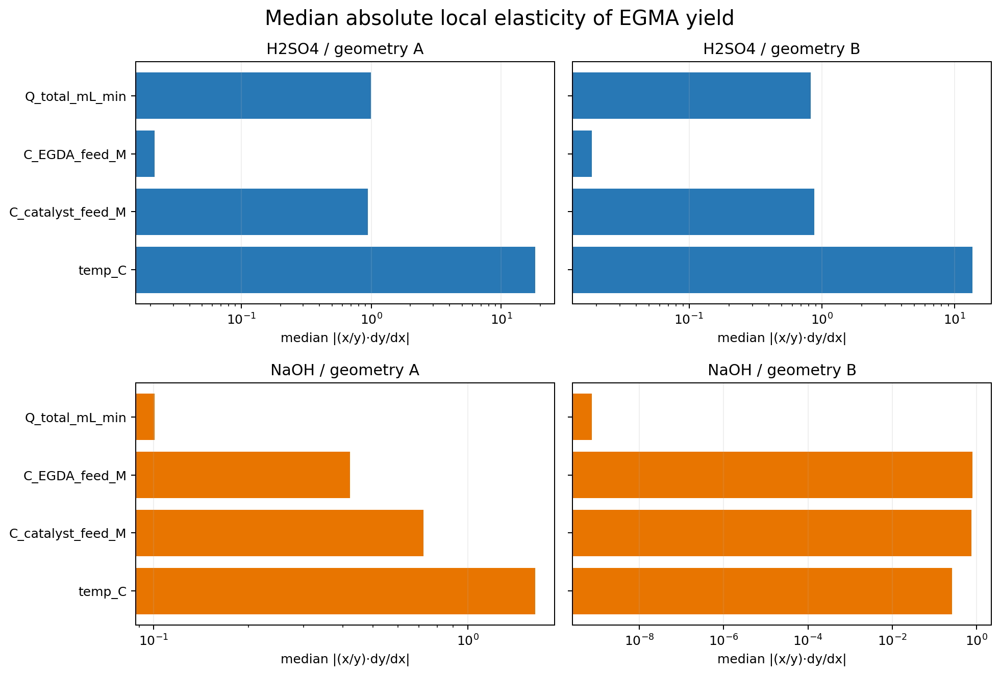

### 5.9 `surrogate_validation.csv` — can a simple response surface reproduce the simulator?

For each study and response, the code standardizes the four input factors and fits an interpretable polynomial containing:

- an intercept;
- four linear terms;
- four squared terms;
- all six two-factor interaction terms.

Validation is leave-one-factor-level-out. For example, all rows at one temperature are removed, the model is fitted to the remaining temperatures, and predictions are evaluated on the omitted temperature. This is stricter than a random split because an entire level is unseen.

The CSV reports RMSE, MAE, $R^2$, maximum absolute error, training/test counts, and design rank for every fold. The figure aggregates the EGMA-yield RMSE by held-out factor.

Median EGMA-yield fold RMSE values are about 0.024 for H₂SO₄/A, 0.035 for H₂SO₄/B, 0.102 for NaOH/A, and 0.094 for NaOH/B. The acid response is captured more smoothly. NaOH is harder because OH exhaustion and overreaction introduce sharp nonlinear boundaries. Some boundary folds have negative $R^2$—including an extreme acid/A extrapolation fold—so the response surface must not replace the mechanistic model outside well-validated regions.

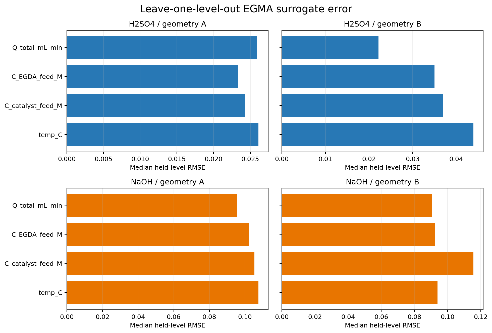

### 5.10 `regime_assignments.csv` — transparent flags for every scenario

Each scenario receives independent Boolean flags using thresholds in `analysis_config.json`:

- low conversion: $X_{\mathrm{EGDA}}\le0.10$;
- overreaction: $Y_{\mathrm{EG}}>Y_{\mathrm{EGMA}}$;
- EGMA-selective: $S_{\mathrm{EGMA}}\ge0.70$ and $Y_{\mathrm{EGMA}}\ge0.20$;
- interior EGMA peak;
- NaOH exhausted: outlet OH ≤1% of inlet OH;
- NaOH stoichiometric limitation: $R_{\mathrm{OH}}<1$;
- acid equilibrium proximity: at least one configured equilibrium indicator ≥0.90;
- physical-validity question.

Flags are not mutually exclusive. A scenario can, for example, be EGMA-selective, possess an interior peak, and still carry a transport warning. The figure shows their prevalence. All studies carry the physical-validity flag because all cases fail the strict radial-mixing screen. NaOH/B is particularly characterized by OH exhaustion and interior EGMA peaks.

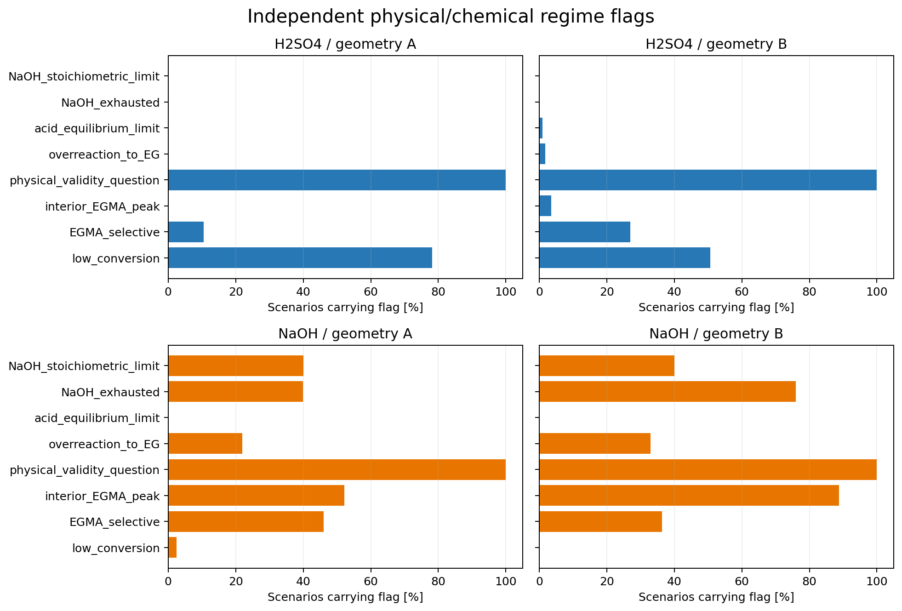

### 5.11 `regime_summary.csv` — one primary chemical label per scenario

For compact summaries, the code assigns one primary chemical regime using a documented priority: NaOH exhaustion, acid equilibrium limitation, overreaction, low conversion, EGMA-selective behavior, interior peak, then intermediate behavior. The independent physical-validity flag remains separate so it does not hide the chemistry.

The current results show:

- H₂SO₄/A: 782 of 1,000 cases are primarily low conversion.
- H₂SO₄/B: 253 of 500 are low conversion and 135 are EGMA-selective.
- NaOH/A: 399 are OH-exhausted, 252 EGMA-selective, and 171 overreacted toward EG.
- NaOH/B: 380 of 500 are OH-exhausted and 115 are overreacted.

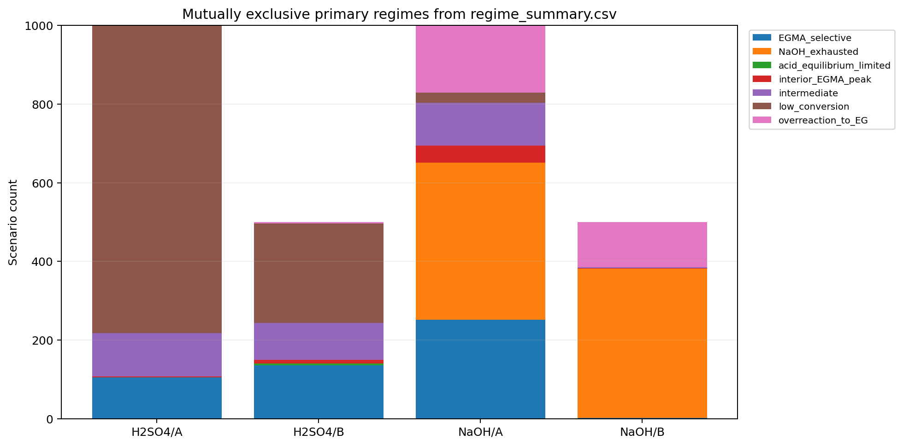

### 5.12 `axial_egma_peaks.csv` — where should the reactor end to preserve EGMA?

EGMA is an intermediate in a consecutive reaction. For every profile, the code finds the maximum saved EGMA concentration and yield, its axial position and residence time, normalized position $x/L$, remaining length/time, whether the peak lies inside the reactor or at the outlet, and whether EGMA is still increasing at the outlet.

It also calculates the interval where $C_{\mathrm{EGMA}}$ is at least 95% of its maximum. A narrow 95% interval means tight residence-time control would be needed to remain close to the best intermediate yield; a wide interval indicates a more forgiving operating region.

Only 2/1,000 H₂SO₄/A and 18/500 H₂SO₄/B cases have an interior peak. Most acid cases are still producing EGMA at the outlet. In contrast, 522/1,000 NaOH/A and 444/500 NaOH/B cases peak inside the reactor. For those cases, additional residence time no longer helps EGMA and instead promotes the second cleavage to EG or follows OH-limited dynamics.

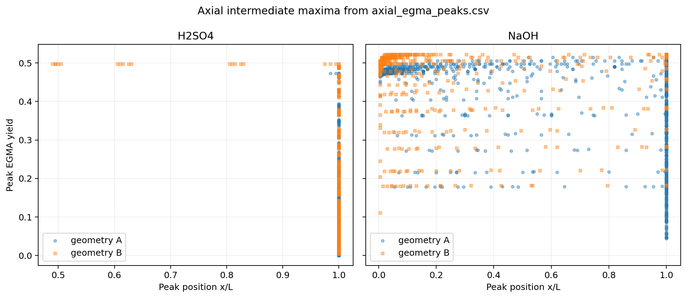

### 5.13 `geometry_collapse_metrics.csv` — can both geometries be compared at equal kinetic exposure?

A clean geometry-collapse test would compare both reactors at the same route, feed state, temperature, and Damköhler number. The existing flow ranges do not supply exact common $\mathrm{Da}_1$ values. The code therefore groups common route/temperature/feed conditions and performs a minimum-cost one-to-one match between A and B using

$$
d_{\mathrm{match}}=\left|\log\!\left(\frac{\mathrm{Da}_{1,B}}{\mathrm{Da}_{1,A}}\right)\right|.
$$

The table records both scenario IDs, both Damköhler numbers, the matching distance, residence times, and differences in conversion, yield, and selectivity.

There are 1,000 matched pairs but zero exact $\mathrm{Da}_1$ matches. The median log-distance is 4.212 and the median absolute EGMA-yield difference is 0.1025. The points lying far from the identity line make the limitation visually clear: this output is a nearest-exposure diagnostic, **not evidence of an intrinsic geometry effect**. A new sweep with deliberately matched residence times or Damköhler numbers is required for that conclusion.

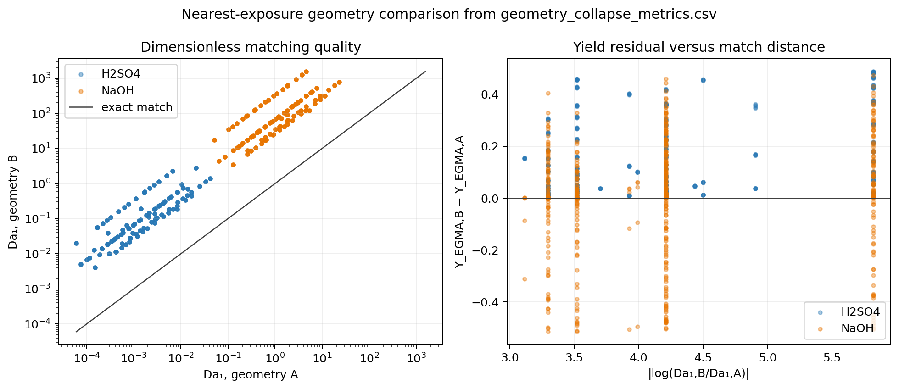

### 5.14 `pareto_front.csv` — exact nondominated trade-offs

A scenario is retained if no other scenario in the same route/geometry study is at least as good in every objective and strictly better in at least one. The configured objectives are:

**Maximize:** EGMA yield, EGMA selectivity, and EGMA STY.

**Minimize:** temperature, catalyst/base feed concentration, residence time, and EG yield.

The resulting front contains 997 H₂SO₄/A, 483 H₂SO₄/B, 431 NaOH/A, and 73 NaOH/B scenarios. The acid fronts are very large because seven competing objectives make domination difficult: a low-temperature/low-acid point can remain nondominated even if its yield is small. The Pareto table should therefore be filtered after engineering priorities—such as a minimum yield or maximum temperature—are agreed.

The figure shows only two objectives for readability; dominance was calculated using all seven.

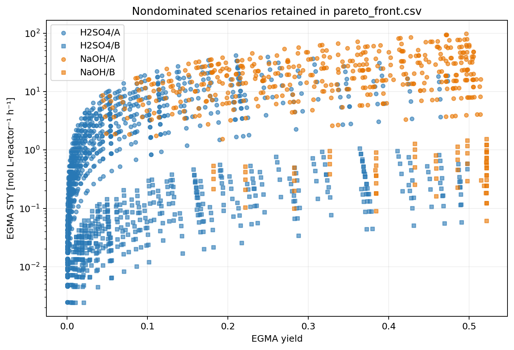

### 5.15 `top_conditions.csv` — a transparent weighted screening rank

This table provides ten convenient screening candidates per study. Each response is min–max scaled within that study and combined as

$$
U=0.40\,Y_{\mathrm{EGMA}}+0.30\,\mathrm{STY}
+0.20\,S_{\mathrm{EGMA}}+0.10\,(\text{low }Y_{\mathrm{EG}}).
$$

The score is a stated preference, not a statistically fitted optimum. Changing the weights changes the ranking. The best-ranked current conditions are:

| Study | T [°C] | Total flow [mL/min] | EGDA feed [M] | Catalyst/base feed [M] | Y_EGMA | STY [mol L-reactor⁻¹ h⁻¹] |
|---|---:|---:|---:|---:|---:|---:|
| H₂SO₄/A | 160 | 6 | 0.5 | 0.5 | 0.306 | 36.52 |
| H₂SO₄/B | 80 | 10 | 0.5 | 0.5 | 0.364 | 1.072 |
| NaOH/A | 80 | 10 | 0.5 | 0.5 | 0.496 | 98.76 |
| NaOH/B | 25 | 10 | 0.5 | 0.5 | 0.522 | 1.538 |

The H₂SO₄/A rank-one point requires pressurization under the default temperature screen, and all four rank-one points retain the radial-segregation warning. Rankings therefore do not override the validity diagnostics.

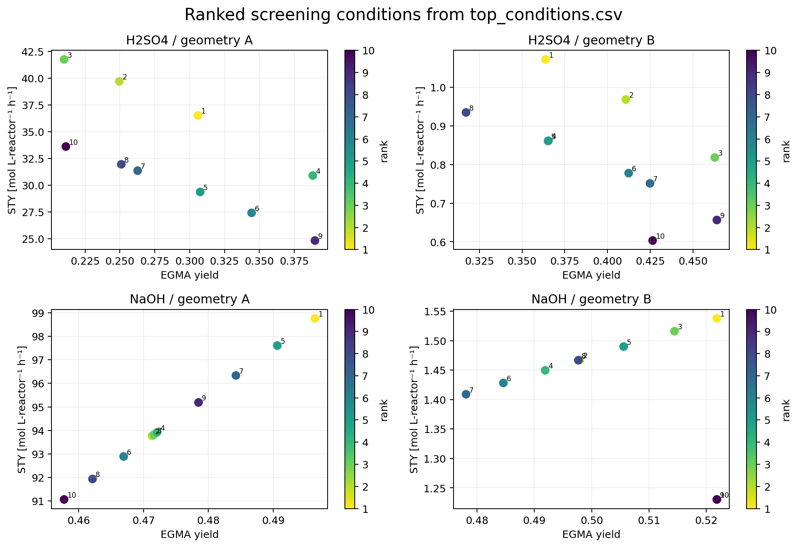

### 5.16 `robust_operating_windows.csv` — good points surrounded by other good points

A robust-window candidate must first satisfy the configured performance limits:

- $X_{\mathrm{EGDA}}\ge0.50$;
- $Y_{\mathrm{EGMA}}\ge0.25$;
- $S_{\mathrm{EGMA}}\ge0.50$;
- $Y_{\mathrm{EG}}\le0.40$;
- temperature ≤100 °C;
- EGMA yield at least 95% of the maximum feasible yield in its study.

The code then moves one grid level up and down in each factor while holding the others fixed. At least 50% of available one-step neighbors must also satisfy the base performance limits. This rejects isolated numerical optima and favors plateaus that should be less sensitive to small operating changes.

There are 0 robust H₂SO₄/A cases, 18 H₂SO₄/B cases, 85 NaOH/A cases, and 105 NaOH/B cases. Physical validity is not required by the current robust-window configuration; therefore these are robust **within the ideal model**, not experimentally validated operating windows. Setting `require_physical_validity` to `true` would currently remove every point because of the radial-mixing diagnostic.

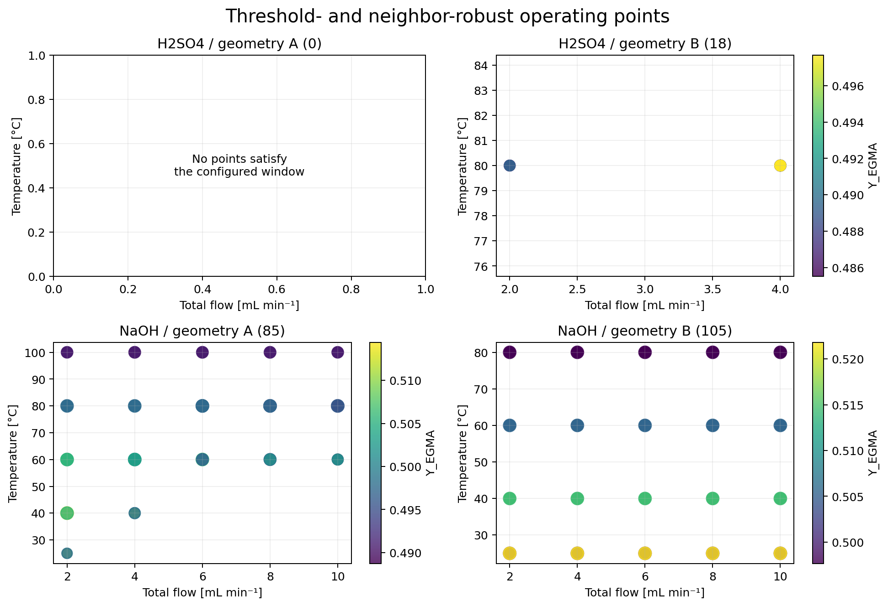

## 6. Other generated outputs

- `analysis_report.md` summarizes the main findings and caveats in a shorter narrative.
- `analysis_config.json` records the exact thresholds and objectives used for this run.
- `analysis_manifest.json` records scenario, Pareto, robust-window, and figure counts.
- `figures/` contains the original analysis figures and a same-named CSV with exactly the plotted data.

## 7. What can and cannot be concluded

The analysis supports strong conclusions about the **behavior of the current mechanistic model over the swept grid**. It shows that acid behavior is mainly controlled by temperature-dependent kinetic exposure, while NaOH behavior is strongly structured by base-to-substrate stoichiometry, OH exhaustion, and overreaction of EGMA to EG. It also identifies where an interior EGMA maximum exists and where broad robust plateaus occur.

It does not establish experimental significance, parameter confidence intervals, or causal geometry effects. There are no experimental replicates or noise model. Geometry B has different temperature coverage, no exact cross-geometry Damköhler matches exist, and all cases fail the strict radial-mixing applicability screen for an empty ideal tube. The present reactor is not a bead-packed bed: porosity, pressure drop, tortuosity, film transfer, and intraparticle diffusion are absent.

## 8. Tests

```powershell
& 'C:\Users\vt4ho\AppData\Local\Programs\Python\Python312\python.exe' `
  -m unittest discover -s .\BatchSweep_Analysis\tests -v
```

The tests cover recursive discovery, missing profiles, duplicate configurations, geometry/flow formulas, axial peaks, exact ANOVA reconstruction, Pareto dominance, geometry matching, and deterministic CSV output.
