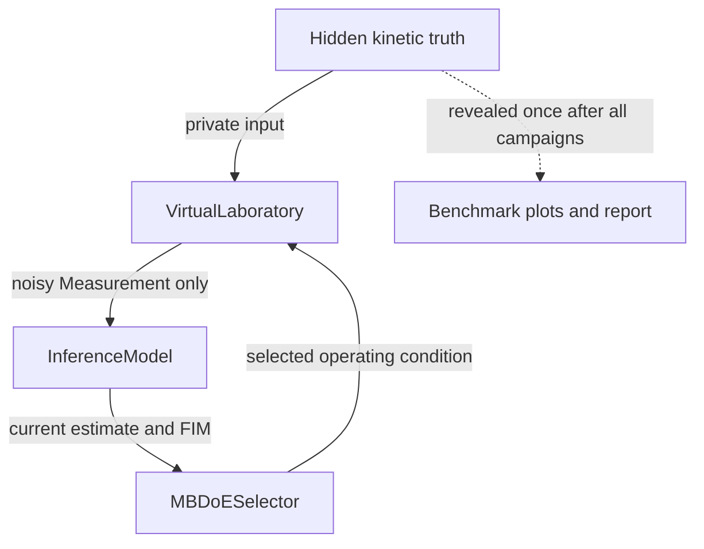
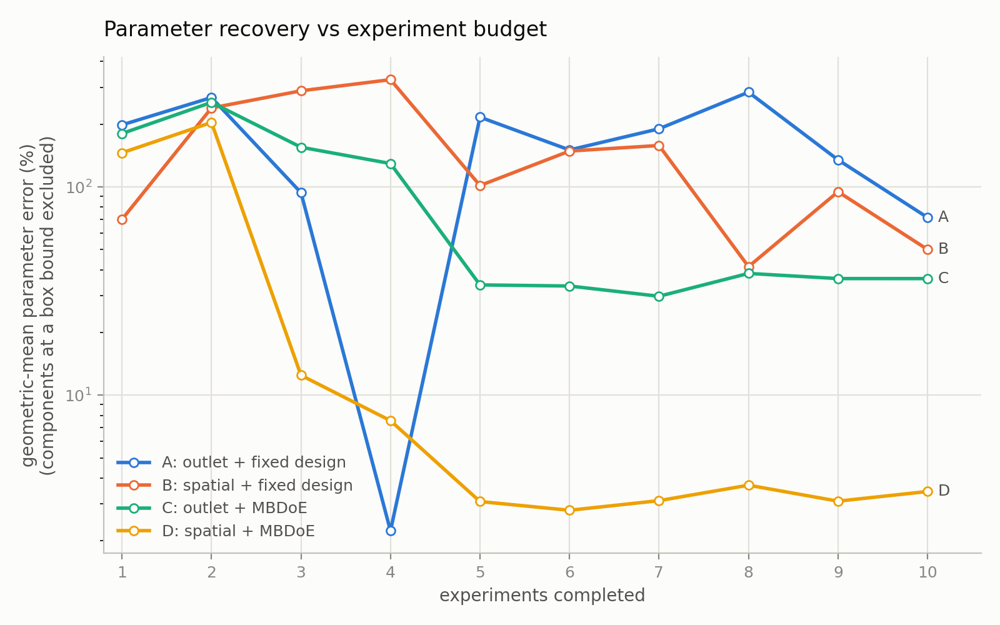
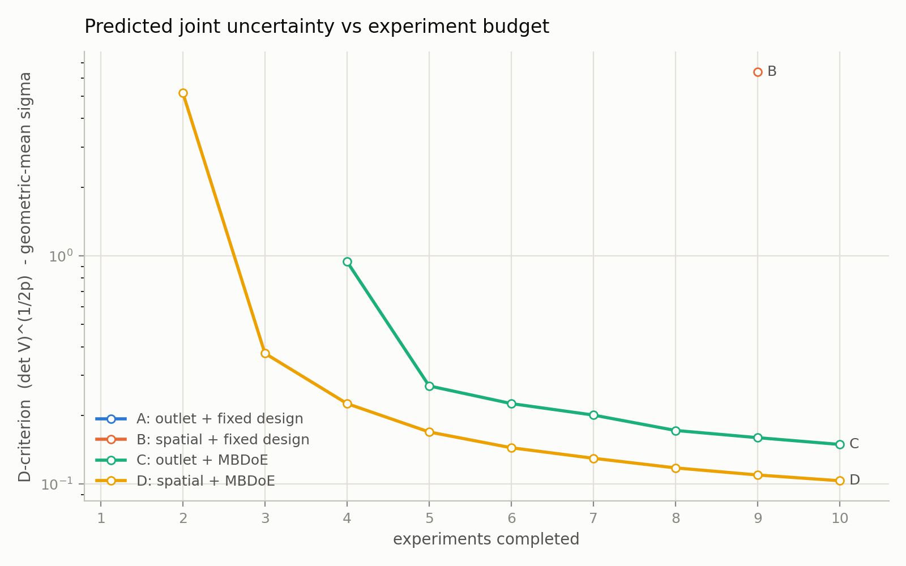
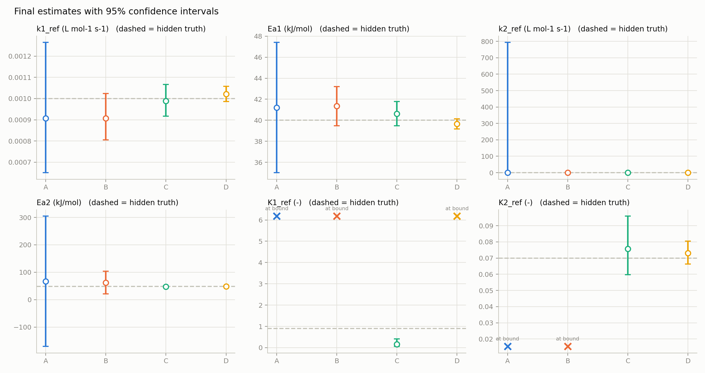
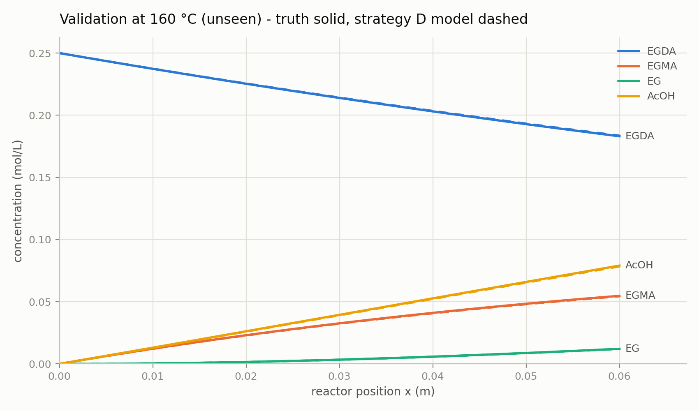

# SDL-MBDoE: a virtual self-driving laboratory for kinetic identification

`SDL_MBDoE` is a **Layer 2 experiment-planning and parameter-estimation system** built around the mechanistic plug-flow-reactor (PFR) digital twin in [`PFR_H2SO4_digital_twin`](../PFR_H2SO4_digital_twin/). It asks a practical research question:

> If only a limited number of reactor experiments can be performed, which operating condition should be tested next, and how much kinetic information is gained by measuring a spatial concentration profile instead of only the reactor outlet?

The software answers this question in a controlled virtual study. It creates synthetic PFR measurements from a hidden set of kinetic parameters, adds realistic measurement noise, repeatedly estimates the kinetics from all data collected so far, calculates parameter uncertainty, and—when Model-Based Design of Experiments (MBDoE) is enabled—selects the next experiment expected to be most informative.

The central comparison is a 2 × 2 study:

| Strategy | Measurement used per experiment | Experiment selection |
|---|---|---|
| **A** | Outlet concentrations only | Fixed temperature program |
| **B** | Eight-point axial concentration profile | Fixed temperature program |
| **C** | Outlet concentrations only | Autonomous MBDoE |
| **D** | Eight-point axial concentration profile | Autonomous MBDoE |

This separates two potential sources of information:

1. **Where the reactor is measured:** one outlet sample or a spatially resolved reaction profile.
2. **How experiments are chosen:** a conventional predefined plan or sequential, model-guided selection.

The default saved example uses reversible, sulfuric-acid-catalyzed hydrolysis. The same framework also supports irreversible NaOH saponification. This README explains the physical problem, every stage of the computational loop, how to run the study, what each output means, and how to interpret the included example without overclaiming what one synthetic campaign can prove.

---

## Contents

- [What problem does this solve?](#what-problem-does-this-solve)
- [What the software is—and is not](#what-the-software-isand-is-not)
- [Physical and kinetic model](#physical-and-kinetic-model)
- [What constitutes an experiment](#what-constitutes-an-experiment)
- [The four strategies](#the-four-strategies)
- [The self-driving loop](#the-self-driving-loop)
- [Hidden truth and the truth firewall](#hidden-truth-and-the-truth-firewall)
- [Parameter estimation](#parameter-estimation)
- [Uncertainty and Fisher information](#uncertainty-and-fisher-information)
- [How MBDoE chooses the next experiment](#how-mbdoe-chooses-the-next-experiment)
- [Installation and use](#installation-and-use)
- [Configuration reference](#configuration-reference)
- [Outputs and how to read them](#outputs-and-how-to-read-them)
- [Worked example: the included H2SO4 campaign](#worked-example-the-included-h2so4-campaign)
- [Limitations and responsible interpretation](#limitations-and-responsible-interpretation)
- [Code map](#code-map)
- [Troubleshooting](#troubleshooting)

---

## What problem does this solve?

Kinetic identification is not only an optimization problem; it is also an **information-generation problem**. Rate constants, activation energies, and equilibrium constants must be inferred from finite, noisy measurements. If experiments are performed only where the reactor response is insensitive to a parameter, no estimator can recover that parameter reliably, regardless of how sophisticated the optimizer is.

For the two-step conversion considered here, several effects make the problem difficult:

- The first and second reaction steps influence overlapping species profiles.
- A rate constant and its activation energy can be strongly correlated over a limited temperature window.
- For reversible acid hydrolysis, forward kinetics and equilibrium constants can compensate for one another.
- Outlet-only measurements compress an entire reaction trajectory into one axial point.
- Instrument noise and overlapping NMR signals obscure small concentration differences.
- Each reactor experiment has a cost, so testing every possible condition is generally undesirable.

The purpose of this package is therefore to study whether **spatial measurements** and **sequential MBDoE** can make the kinetic parameters more identifiable under a fixed experiment budget.

The package does not replace the Layer 1 reactor model. It wraps that model with the logic required to simulate an autonomous experimental campaign:


## What the software is—and is not

### It is

- A virtual benchmark for **sequential kinetic parameter identification**.
- A comparison between outlet and spatially resolved measurement strategies.
- A comparison between fixed experiment planning and locally optimal MBDoE.
- A catalyst-aware wrapper around the existing PFR digital twin.
- A way to quantify expected information using sensitivities and the Fisher Information Matrix (FIM).
- A reproducible demonstration of a self-driving-laboratory loop before connection to real hardware.

### It is not

- A controller for physical pumps, valves, an NMR instrument, or a reactor.
- A direct optimizer of EGMA yield, conversion, selectivity, profit, or safety.
- A Bayesian inference implementation or a global posterior analysis.
- Proof that one strategy is universally superior based on a single noise realization.
- A packed-bed model. The underlying reactor is a homogeneous PFR; no bead geometry, intraparticle diffusion, external mass transfer, or catalyst-bed pressure drop is represented here.
- A replacement for model-validation experiments with real data.

The word **self-driving** refers specifically to the closed software loop that chooses the next candidate experiment from the information predicted by the current model. The included laboratory is virtual.

---

## Physical and kinetic model

### Reactor and feed arrangement

The default reactor is a cylindrical homogeneous PFR with:

| Quantity | Default value |
|---|---:|
| Length | 0.500 m |
| Internal diameter | 0.018 m |
| EGDA-stream flow | one half of total flow |
| Catalyst/reagent-stream flow | one half of total flow |

Two liquid streams are mixed at the reactor inlet:

1. an aqueous EGDA stream with concentration `C_EGDA_M`, and
2. an aqueous H2SO4 or NaOH stream with concentration `C_cat_M`.

The design-space concentrations are **pre-mixing stream concentrations**. Because the current candidate builder divides the total flow equally between the two streams, each solute is diluted on mixing. For example, two equal flows containing 1.0 M EGDA in stream 1 and 1.0 M H2SO4 in stream 2 produce ideal mixed-feed analytical concentrations of approximately 0.5 M EGDA and 0.5 M H2SO4 before acid speciation and reaction are considered.

This explains why a configured NaOH stream concentration of 0.5 M begins near 0.25 M in a mixed-feed profile: the factor of two comes from equal-flow dilution, not from instantaneous chemical consumption. Subsequent axial decline is caused by reaction.

### Reaction network

The model represents two consecutive transformations:

$$
\mathrm{EGDA + H_2O \rightleftharpoons EGMA + AcOH}
$$

$$
\mathrm{EGMA + H_2O \rightleftharpoons EG + AcOH}
$$

Here:

- **EGDA** is ethylene glycol diacetate,
- **EGMA** is ethylene glycol monoacetate,
- **EG** is ethylene glycol, and
- **AcOH** is acetic acid or the corresponding analytical acetate product representation used by the model.

EGMA is an intermediate: it is formed by the first step and consumed by the second. Its concentration may therefore exhibit an internal maximum. The location and height of that maximum contain kinetic information that can be lost when only the outlet is measured. This is one of the main physical motivations for spatial sampling.

### H2SO4 route

For sulfuric-acid catalysis, the default configuration uses the reversible ODE model and estimates six quantities:

| Parameter | Meaning | Unit |
|---|---|---|
| `k1_ref` | step-1 rate constant at the reference temperature | L mol⁻¹ s⁻¹ |
| `Ea1_J` | step-1 activation energy | J mol⁻¹ internally; reported in kJ mol⁻¹ |
| `k2_ref` | step-2 rate constant at the reference temperature | L mol⁻¹ s⁻¹ |
| `Ea2_J` | step-2 activation energy | J mol⁻¹ internally; reported in kJ mol⁻¹ |
| `K1_ref` | step-1 equilibrium constant at the reference temperature | dimensionless |
| `K2_ref` | step-2 equilibrium constant at the reference temperature | dimensionless |

The reverse reactions are included when `reversible: True`, which is the default for H2SO4. The forward and reverse contributions are handled inside the Layer 1 kinetic model. The two reference equilibrium constants are estimated, while their van ’t Hoff enthalpy slopes are held at the Layer 1 literature values. This avoids adding poorly identifiable enthalpy parameters over the limited temperature window.

Acid speciation is also part of the Layer 1 calculation. The default settings are:

```python
"h_plus_model": "equilibrium"
"ka2_model": "tdep"
"activity_model": "dilute"
```

Thus, the second dissociation constant of sulfuric acid is temperature-dependent in the current default code. Changing temperature can alter HSO4⁻/SO4²⁻/H⁺ speciation and therefore the effective acid contribution. Its temperature effect may be weaker than the Arrhenius effect on the reaction rate constants, but it is **not absent** when `ka2_model` is `"tdep"`. Setting it to `"constant"` intentionally fixes it at its 25 °C treatment.

### NaOH route

For NaOH, the bridge forces the reaction model to be irreversible and estimates four parameters:

$$
\theta = (k_{1,\mathrm{ref}}, E_{a,1}, k_{2,\mathrm{ref}}, E_{a,2}).
$$

No equilibrium constants are estimated because saponification is modeled as irreversible. NaOH is **not merely a catalyst label in this route**: hydroxide is consumed stoichiometrically. Consequently, `C_cat_M` becomes a reagent-concentration design variable, and a low NaOH/acetate ratio can make OH⁻ limiting.

The NaOH design window is colder and faster-flowing than the H2SO4 window because the configured saponification kinetics are much faster. The ODE engine is required because the reagent depletes and the acid-route irreversible analytical solution does not apply.

### Temperature parameterization

Instead of directly estimating an Arrhenius pre-exponential factor and activation energy, the package estimates a rate constant at a reference temperature inside the design window:

$$
k_i(T)=k_{i,\mathrm{ref}}
\exp\!\left[-\frac{E_{a,i}}{R}
\left(\frac{1}{T}-\frac{1}{T_{\mathrm{ref}}}\right)\right].
$$

The default reference temperature is 60 °C. The bridge converts the fitted reference rate constant to the pre-exponential form required by Layer 1:

$$
A_i=k_{i,\mathrm{ref}}\exp\!\left(\frac{E_{a,i}}{R T_{\mathrm{ref}}}\right).
$$

This reference-temperature parameterization reduces the severe numerical correlation that commonly occurs when fitting $A$ and $E_a$ directly over a moderate temperature interval.

For optimization, positive quantities are represented logarithmically and activation energies are scaled to kJ mol⁻¹:

$$
\theta_{\mathrm{H_2SO_4}}=
[\ln k_{1,\mathrm{ref}}, E_{a,1}/1000,
 \ln k_{2,\mathrm{ref}}, E_{a,2}/1000,
 \ln K_{1,\mathrm{ref}}, \ln K_{2,\mathrm{ref}}].
$$

The logarithms enforce positivity, while the scaling keeps the numerical magnitudes of the fitted components more comparable.

---

## What constitutes an experiment?

An experiment is defined by an `OperatingConditions` record:

- reactor temperature `T_C`,
- EGDA-stream flow `Q1_mL_min`,
- catalyst/reagent-stream flow `Q2_mL_min`,
- EGDA concentration in stream 1 `C_EGDA_M`, and
- H2SO4 or NaOH concentration in stream 2 `C_cat_M`.

In the supplied design builders, `Q1 = Q2 = Q_total / 2`.

For autonomous strategies, the coarse candidate grid varies temperature,
total flow, catalyst/reagent-stream concentration, and EGDA-stream
concentration. Fixed strategies retain one configured EGDA concentration.

The virtual laboratory simulates the PFR at those conditions and returns concentrations for the configured measured species. With the defaults, the measured species are EGDA, EGMA, EG, and AcOH.

### Outlet measurement

An outlet experiment measures four values:

$$
[C_{\mathrm{EGDA}}(L), C_{\mathrm{EGMA}}(L),
 C_{\mathrm{EG}}(L), C_{\mathrm{AcOH}}(L)].
$$

### Spatial measurement

A spatial experiment samples eight equally spaced axial positions:

$$
z=\frac{L}{8},\frac{2L}{8},\ldots,L.
$$

The inlet at $z=0$ is not one of the measurement ports; the outlet at $z=L$ is. Four species at eight ports produce 32 concentration observations per experiment.

The flattened measurement vector is species-major:

$$
\mathbf y = [C_1(z_1),\ldots,C_1(z_{N_z}),
C_2(z_1),\ldots,C_{N_s}(z_{N_z})].
$$

### An important fairness distinction

All four strategies receive the same **number of reactor experiments**, but they do not receive the same number of measured concentration values:

- 8 outlet experiments × 4 species = **32 observations** for A or C.
- 8 spatial experiments × 8 ports × 4 species = **256 observations** for B or D.

The comparison therefore answers, “What happens under an equal experiment budget if spatial sampling is available?” It is not an equal-sample-count or equal-measurement-cost comparison. If every sampling port has a significant cost, that cost should be incorporated into a future design study.

---

## The four strategies

### A — outlet + fixed design

This is the conventional baseline. It follows a predefined temperature sequence at nominal total flow and catalyst concentration, measuring only the outlet. It does not respond to the data collected during the campaign.

### B — spatial + fixed design

This uses the same predefined operating sequence as A but measures eight axial positions. Comparing B with A isolates the practical value of spatial resolution under the current equal-experiment-budget definition.

### C — outlet + MBDoE

This measures only the outlet, but after each fit it searches the candidate grid for the next experiment expected to provide the greatest information. Comparing C with A examines the effect of autonomous selection when the observation type remains outlet-only.

### D — spatial + MBDoE

This combines spatial measurements with autonomous selection. It has access to reaction-shape information and can move through temperature, flow, and feed-concentration space in response to the current parameter estimate.

Every strategy starts with the first fixed-design condition, uses the same initial literature parameter guess and hidden parameter truth, and receives the same maximum number of experiments. Each strategy is assigned a deterministic seed offset, so results are reproducible. However, the strategies do receive different noise draws; a single run is consequently a reproducible demonstration, not a noise-free paired statistical comparison.

---

## Identifiability screen (before any experiment is spent)

[`sdl/identifiability.py`](sdl/identifiability.py) asks the question the FIM was always able to answer but the loop never asked: **which parameters can this platform identify anywhere in this design box?**

A structurally undetermined parameter left inside θ does real damage. It contributes a flat direction, so F is rank deficient and `logdet F` collapses to −∞, which makes the D-criterion useless as a design score. The bounded least-squares fit then walks it to a box bound and parks it there, so the reported "estimate" is the constraint rather than the data. And it goes on to dominate any error metric averaged over θ.

The screen builds a **reference campaign**: at the initial guess it scores every candidate in the design grid, then greedily assembles the D-optimal `budget`-experiment design from them. That is the best campaign this platform could run inside these bounds, so a parameter still undetermined under it is undetermined under every strategy being compared — hold it fixed, and repeat, since removing one flat direction can rescue another that was merely aliased with it.

A *fixed* reference design (box corners, a temperature ladder) is not a valid substitute. It is only one design, and a poor one: screening on box corners wrongly condemns `k2_ref`, which the D-optimal design pins to roughly 4 %.

The screen runs once and costs a single sensitivity pass over the candidate grid (~20 s for the default 2 817 candidates). Its verdict is printed and written into `final_report.txt`. On the default acid configuration all six parameters survive, with `K1_ref` the marginal one at ~82 % best achievable CI — consistent with it being the parameter every strategy then struggles with.

### Constraint activity is reported, never hidden

`ParameterSpace.active_bounds` flags any component resting on its box constraint after each fit, and the report surfaces it. This matters because the FIM covariance is an **unconstrained** local approximation: it knows nothing about an active constraint, so every interval quoted next to a pinned component is void. Such components are printed as `AT BOUND - no valid CI`, drawn as an `×` in `final_estimates.png`, excluded from the ranking score, and force `max_rel_ci_pct` to infinity so early stopping cannot trigger while one is pinned.

Note that the box itself is anchored to the literature guess (`guess ×/÷ 30` for rate constants, `×/÷ 10` for equilibrium constants). A parameter with a nearly flat likelihood direction will drift to whichever wall it happens to face; the honest reading is "undetermined", not "estimated at the bound".

---

## The self-driving loop

For each strategy, [`run_strategy`](sdl/campaign.py) performs the following sequence.

### 1. Select an operating condition

The first condition is common to every strategy. In later rounds:

- a fixed strategy takes the next condition from `fixed_design_T_C`, or
- an MBDoE strategy evaluates the feasible candidate grid and selects its best-scoring condition.

`build_fixed_design` **subsamples** `fixed_design_T_C` evenly to the experiment budget rather than truncating it. This matters: the loop walks the list in order, so a 25-rung 40–160 °C ladder consumed by a 10-experiment budget would otherwise run only the coldest ten rungs (40–85 °C), a region where little converts and the FIM is rank deficient by construction. That handicaps the conventional baseline and confounds “adaptive versus fixed” with “sees the whole box versus one cold edge”. Spreading the same ten experiments over the same declared ladder lowers the FIM condition number by roughly six orders of magnitude at no extra cost.

### 2. Run the virtual experiment

The virtual laboratory passes the selected condition and the private true kinetic parameters to Layer 1. It extracts either the outlet or the configured spatial ports, applies optional truth-only systematic effects, creates a measurement covariance, and adds a random correlated noise realization.

Only the resulting `Measurement` object is returned. It contains the operating condition, sampling locations, species names, and noisy concentrations—not the true parameters or the actual noise draw.

### 3. Add the measurement to the accumulated dataset

The new measurement is appended to all previous measurements for that strategy. The estimator is cumulative: round 8 fits all data from rounds 1–8, not only the newest experiment.

### 4. Re-estimate every kinetic parameter

Weighted nonlinear least squares is warm-started from the previous fitted value. After each new experiment, all active parameters are jointly refitted within physical/numerical bounds.

### 5. Recompute local uncertainty

Finite-difference sensitivities are evaluated around the current estimate. These form the cumulative FIM, from which approximate covariance, confidence intervals, correlations, eigenvalues, log-determinant, and a D-criterion uncertainty measure are calculated.

### 6. Check the stopping condition

By default, every strategy uses its full experiment budget. If `target_rel_ci_pct` is set, a campaign can stop early only when the FIM is judged well posed and the worst approximate 95% relative confidence half-width is below the target.

### 7. Let MBDoE choose the next experiment

For C or D, every feasible candidate is simulated at the current estimate. Its expected information contribution is added to the current FIM, and the criterion selects the highest-scoring candidate. The candidate is executed in the next round, and the loop repeats.

Repeated conditions are permitted. A repeat is not necessarily a failure: under the assumed noise model, replication at a highly sensitive condition can further reduce variance.

---

## Hidden truth and the truth firewall

A virtual study needs known parameter values to generate synthetic data and later judge recovery. At the same time, allowing the design or estimator to see those values would make the benchmark circular. The package therefore separates the components as follows:



The [`VirtualLaboratory`](sdl/truth.py) stores the truth privately. Neither [`InferenceModel`](sdl/inference.py) nor [`MBDoESelector`](sdl/design.py) receives it. `reveal_truth()` is called once after the campaigns are finished so that synthetic-study error plots and reports can be produced.

This is a software-level separation intended to prevent accidental leakage during the closed loop; it is not a cryptographic security boundary. The top-level script necessarily constructs the virtual truth before giving it to the laboratory. The self-test checks that the campaign itself does not reveal it.

In a real laboratory there is no reveal step. The truth-dependent error curve and “best strategy by true error” would be unavailable; decisions would instead rely on uncertainty, residual diagnostics, predictive validation, and independent experiments.

---

## Measurement and noise model

The synthetic CPR-NMR model combines an absolute concentration floor with a relative integration error. For predicted or clean concentration $C_j$, the standard deviation is

$$
\sigma_j=\sigma_{\mathrm{abs}}+\sigma_{\mathrm{rel}}\max(C_j,0).
$$

The defaults are:

| Noise term | Default | Interpretation |
|---|---:|---|
| `sigma_abs_M` | 0.004 M | absolute concentration noise floor |
| `sigma_rel` | 0.02 | 2% concentration-dependent error |
| `rho_overlap` | 0.3 | EGDA/EGMA same-port error correlation |

The EGDA and EGMA errors can be correlated at a given port to represent overlapping acetyl resonances. Errors at different axial ports and other species pairs are uncorrelated in the current covariance model.

Two noise configurations exist deliberately:

- `noise_true`: generates the synthetic instrument noise.
- `noise_assumed`: weights residuals and constructs expected candidate information.

They are identical in the default well-calibrated case. Making them different is useful for robustness studies, but then the estimator’s reported uncertainty is based on a misspecified error model.

Optional truth-only systematic effects include:

- `transfer_time_s`: samples continue to react after withdrawal, and
- `calibration_gain`: a species-specific multiplicative measurement bias.

Because these effects are applied only in the virtual laboratory, they can test how an inference model that ignores them becomes biased or overconfident.

---

## Parameter estimation

After every experiment, the code minimizes a weighted least-squares objective over all accumulated measurements:

$$
\hat\theta = \arg\min_{\theta}
\sum_e
\left(\hat{\mathbf y}_e(\theta)-\mathbf y_e\right)^\mathsf{T}
\Sigma_e^{-1}
\left(\hat{\mathbf y}_e(\theta)-\mathbf y_e\right).
$$

Here, $e$ indexes experiments, $\mathbf y_e$ is the noisy measurement, $\hat{\mathbf y}_e$ is the Layer 1 prediction, and $\Sigma_e$ is the assumed observation covariance.

Numerically, each residual vector is whitened using a Cholesky factor of $\Sigma_e$, and SciPy’s bounded trust-region least-squares algorithm (`method="trf"`) solves the problem. The fitted solution from one round initializes the next fit.

The default parameter bounds are deliberately broad but finite:

- each rate constant: literature guess divided by 30 to multiplied by 30,
- each acid equilibrium constant: literature guess divided by 10 to multiplied by 10,
- each activation energy: 20–120 kJ mol⁻¹.

These bounds prevent nonphysical values and reduce numerical failure, but a result pressed against a bound is a warning that the data, model, or chosen bounds need examination.

---

## Uncertainty and Fisher information

### Sensitivity matrix

For one experiment, the local sensitivity matrix is

$$
S_e=\frac{\partial \hat{\mathbf y}_e}{\partial\theta}.
$$

Each column asks how the predicted concentration vector changes when one scaled parameter is perturbed. Large, linearly independent columns are desirable. Nearly proportional columns indicate that two parameters affect the data similarly and are difficult to distinguish.

The estimation FIM uses central finite differences. Candidate screening uses forward finite differences to reduce the cost of evaluating every possible experiment.

### Fisher Information Matrix

The cumulative information matrix is

$$
F=\sum_e S_e^\mathsf{T}\Sigma_e^{-1}S_e.
$$

Under a local linear approximation and a correctly specified Gaussian noise model, the parameter covariance is approximated by

$$
V_\theta\approx F^{-1}.
$$

If the FIM is numerically rank deficient the result is flagged as not well posed, `logdet_F` is reported as negative infinity, and `d_criterion` as infinity.

The inverse itself is taken by **flooring the eigenvalues** of F ([`covariance_from_fim`](sdl/inference.py)), not with `numpy.linalg.pinv`. A pseudoinverse assigns *zero* variance to the null space — that is, infinite confidence in exactly the directions the data never constrained, which is the opposite of the truth. Flooring inverts those directions to a very large variance instead, which is the honest answer and is what makes the identifiability screen work at all.

The same flooring is applied to the **design criteria** in [`sdl/design.py`](sdl/design.py). `slogdet` returns −∞ for any singular F, so while the accumulated information was still rank deficient — precisely the early rounds where the choice matters most — every candidate scored −∞ and the selection loop could not rank them at all; it kept its first arbitrary pick. With floored eigenvalues the D- and A-criteria stay finite and strictly increasing in information, so the greedy step still prefers the candidate that best fills the weakest direction.

### Reported uncertainty measures

| Quantity | Direction | Meaning |
|---|---|---|
| `logdet_F` | larger is better | overall local information volume |
| `d_criterion` | smaller is better | \((\det V)^{1/(2p)}\), a geometric-mean uncertainty scale |
| `max_rel_ci_pct` | smaller is better | worst approximate 95% relative CI half-width among parameters |
| FIM eigenvalues | larger away from zero is better | information along independent parameter combinations |
| parameter correlation | magnitude near 0 is preferable | local coupling between fitted parameters |

For logarithmic parameters, confidence limits are mapped back multiplicatively. For activation energies, the reported relative interval is based on the scaled linear standard error.

These intervals are **local, asymptotic approximations**, not exact finite-sample confidence guarantees. Strong nonlinearity, boundary solutions, systematic bias, an incorrect noise model, or model-form error can make them optimistic or misleading.

---

## How MBDoE chooses the next experiment

The coarse candidate set is a full factorial grid over temperature, total
flow, H2SO4/NaOH stream concentration, and EGDA stream concentration. At the
current parameter estimate, every candidate produces a predicted observation
vector, covariance, and sensitivity matrix. Its expected FIM contribution is
added to the information already collected.

When `continuous_design` is `False`, the best grid point is returned. When it
is `True`, the best grid point initializes a bounded Powell optimization over
all four operating variables. The continuous result is accepted only if it
has a finite score and improves on the best grid score; otherwise the selector
falls back to the grid result. `continuous_bounds` is therefore an enforced
admissible region, but those numerical limits must be validated by the user
for chemistry, equipment, analytical sensitivity, and safety.

### D-optimal design

The default criterion selects

$$
u^*=\arg\max_u \log\det\left(F_{\mathrm{current}}+F_{\mathrm{candidate}}(u)\right).
$$

D-optimality seeks to shrink the joint parameter-uncertainty ellipsoid. It balances all estimable parameter directions through the determinant, although it can still leave one scientifically important parameter less precise than desired.

### A-optimal design

With `mbdoe_criterion: "A"`, the score is the negative trace of the inverse FIM. Maximizing it is equivalent to minimizing the sum of local parameter variances in the scaled estimator space:

$$
u^*=\arg\min_u \operatorname{tr}\left(F(u)^{-1}\right).
$$

### What the selection physically tends to explore

The selector can obtain different types of information by changing:

- **Temperature:** separates reference rates from activation energies through Arrhenius curvature.
- **Flow/residence time:** moves the observable reaction progress and the EGMA maximum along the reactor.
- **Acid concentration:** changes the acid-catalyzed rate and speciation environment.
- **NaOH concentration:** changes both rate and stoichiometric availability because hydroxide is consumed.
- **EGDA concentration:** changes the substrate loading, reaction-rate scale, and—in the NaOH route—the hydroxide/acetate stoichiometric ratio.
- **Spatial versus outlet sampling:** preserves or discards the shape of the reaction trajectory.

The algorithm is local in parameter space: it evaluates designs using the
current estimate and assumed noise model. Early inaccurate estimates can
therefore guide the campaign toward a locally attractive region. The optional
continuous search is also locally initialized from the best coarse candidate;
it is a fine-refinement step, not a guarantee of the globally optimal design.

Most importantly, the selection target is kinetic information—not maximum conversion, maximum EGMA concentration, or a production objective. A condition with modest product yield can still be extremely valuable if it separates competing parameter effects.

---

## Installation and use

### Prerequisites

- Python 3.10 or newer is recommended.
- The sibling [`PFR_H2SO4_digital_twin`](../PFR_H2SO4_digital_twin/) directory must be present because the bridge imports the Layer 1 model from it.
- Required Python packages are listed in [`requirements.txt`](requirements.txt): NumPy, SciPy, and Matplotlib.

From this directory, install the dependencies with:

```bash
python -m pip install -r requirements.txt
```

### Run from an IDE

The intended workflow is:

1. Open [`run_sdl_campaign.py`](run_sdl_campaign.py).
2. Edit only the `CONFIG` dictionary for the desired study.
3. Run that file in the IDE.
4. Follow round-by-round fit and uncertainty progress in the console.
5. Inspect the selected output directory when the four campaigns finish.

No command-line arguments are required. Relative `outdir` paths are resolved relative to `run_sdl_campaign.py`, not necessarily the IDE’s working directory.

### Run from a terminal

```bash
cd SDL_MBDoE
python run_sdl_campaign.py
```

The default campaign is computationally heavier than a single PFR simulation because every round performs nonlinear fitting, finite-difference sensitivities, and—for C and D—forward simulations over the entire candidate grid.

### Run the self-test

```bash
cd SDL_MBDoE
python tests/self_test.py
```

The self-test exercises Layer 1 isolation, the truth firewall, catalyst-specific parameter dimensions, uncertainty behavior, MBDoE selection, and a small end-to-end campaign.

---

## Configuration reference

All normal user settings are collected in `CONFIG` at the top of [`run_sdl_campaign.py`](run_sdl_campaign.py).

### Campaign controls

| Key | Default | Effect |
|---|---|---|
| `seed` | `7` | master random seed; a strategy-specific offset is added |
| `budget` | `8` | maximum reactor experiments per strategy |
| `strategies` | `A, B, C, D` | strategies to run |
| `target_rel_ci_pct` | `None` | optional early-stop threshold for the worst 95% relative CI |
| `catalyst` | `H2SO4` | selects reversible acid hydrolysis or irreversible NaOH saponification |
| `identifiability_screen` | `True` | hold structurally undetermined parameters fixed before the campaign starts (see below) |
| `identifiability_max_rel_ci_pct` | `200.0` | drop a parameter when even the best affordable design leaves its 95% CI above this |
| `mbdoe_criterion` | `D` | D- or A-optimal candidate score |
| `continuous_design` | `False` | if true, refine the best coarse MBDoE candidate continuously inside configured bounds |
| `continuous_maxiter` | `30` | maximum Powell iterations for each continuous refinement |
| `outdir` | `results` | output directory, relative to the entry script unless absolute |

If H2SO4 and NaOH are run sequentially with the same `outdir`, the standard filenames are overwritten. Use separate paths such as `results_h2so4` and `results_naoh` when both sets must be retained.

### Default H2SO4 candidate space

| Axis | Levels |
|---|---|
| Temperature | 30, 40, 50, 60, 70, 80, 90 °C |
| Total flow | 4, 10, 20 mL min⁻¹ |
| H2SO4 stream concentration | 0.3, 1.0 M |
| EGDA stream concentration | 0.5, 0.75, 1.0 M |

This creates $7\times3\times2\times3=126$ coarse candidate experiments. The
fixed design uses its own eight-temperature sequence at 10 mL min⁻¹, 1.0 M
H2SO4 stream concentration, and 1.0 M EGDA stream concentration.

### Default NaOH candidate space

| Axis | Levels |
|---|---|
| Temperature | 10, 20, 30, 40, 50 °C |
| Total flow | 10, 20, 40 mL min⁻¹ |
| NaOH stream concentration | 0.5, 1.0 M |
| EGDA stream concentration | 0.25, 0.50, 0.75 M |

This creates $5\times3\times2\times3=90$ coarse candidates. The lower
temperatures and higher flows reflect the faster base reaction. Varying both
NaOH and EGDA concentrations probes different mixed-feed
hydroxide/acetate stoichiometries.

Each catalyst design also defines `continuous_bounds` for `T_C`,
`Q_total_mL_min`, `C_cat_M`, and `C_EGDA_M`. All coarse candidates must lie
inside these bounds. The defaults match the extrema of the coarse levels so
continuous refinement interpolates within the same nominal region rather
than extrapolating beyond it.

### Forward-model controls

| Key | Options | Notes |
|---|---|---|
| `forward_engine` | `ode`, `analytical` | analytical is valid only for the irreversible acid limit |
| `reversible` | `True`, `False` | applies to H2SO4; NaOH is always forced irreversible |
| `h_plus_model` | Layer 1 options | default acid proton model is equilibrium speciation |
| `ka2_model` | `tdep`, `constant` | temperature-dependent or constant sulfuric-acid second dissociation treatment |
| `activity_model` | `dilute`, `pitzer` | selects the Layer 1 activity treatment |

### Safe interpretation of configuration changes

Changing the candidate grid or continuous bounds changes the question the
MBDoE algorithm is allowed to answer. Increasing grid density raises runtime
approximately in proportion to the number of candidates. Continuous
refinement adds repeated FIM evaluations after grid screening. Expanding any
range requires confirming that all conditions remain physically feasible and
that the Layer 1 property, activity, phase, and kinetic assumptions remain
suitable throughout the region.

Changing the hidden truth is appropriate for virtual robustness experiments, but it should not be described as an estimator input. Changing the truth and the literature initial guess together can unintentionally make the identification task easier.

---

## Outputs and how to read them

The default run writes six artifacts to [`results/`](results/). The four included PNG files and two data/report files all come from the same saved H2SO4 run.

### `campaign_history.csv`

[`campaign_history.csv`](results/campaign_history.csv) is the machine-readable record of every completed round. Each row corresponds to one strategy after one newly accumulated experiment.

| Column group | Contents | Interpretation |
|---|---|---|
| Identity | `strategy`, `round` | which campaign and iteration produced the row |
| Data volume | `n_experiments`, `n_data` | cumulative experiments and scalar concentrations |
| Selected condition | `T_C`, `Q_total_mL_min`, `C_EGDA_M`, `C_cat_M` | experiment executed in that round |
| Parameter estimates | `k1_ref`, `Ea1_kJ`, `k2_ref`, `Ea2_kJ`, and acid `K1_ref`, `K2_ref` | current natural-scale best fit |
| Standard errors | `sigma_*` | local 1σ uncertainty in estimator coordinates; log scale for k/K and kJ mol⁻¹ for Ea |
| Information | `logdet_F`, `d_criterion`, `max_rel_ci_pct` | cumulative local identifiability measures |
| Constraint activity | `active_bounds` | `|`-separated parameters resting on a box bound in that round |
| Synthetic benchmark | `mean_rel_err_pct`, `log_mean_rel_err_pct` | arithmetic and geometric mean error against hidden truth |

Both benchmark columns are useful only because this is a virtual experiment. Neither can be computed for unknown kinetics in a real campaign. `active_bounds`, by contrast, needs no truth and **is** available in a real campaign — it is the column to watch.

The CSV supports additional analysis such as plotting one parameter over rounds, comparing selected conditions, checking when the FIM becomes well posed, or running repeated campaigns over many seeds.

### `convergence_error.png`



This plot shows the **geometric mean** multiplicative error over the parameters actually being estimated — those still in θ after the identifiability screen and not resting on a box bound in that round:

$$
\mathrm{GME}=100\left[\exp\!\left(\frac{1}{|S|}\sum_{q\in S}
\left|\ln\frac{\hat\theta_q}{\theta_{q,\mathrm{true}}}\right|\right)-1\right],
\qquad
S=\{q:\theta_q\ \text{estimated and not at a bound}\}.
$$

This replaced the arithmetic mean relative error, which is still written to `campaign_history.csv` but is **no longer used to rank strategies**. The arithmetic mean is unbounded above and bounded by 100 % below, so a single badly determined parameter swamps several well determined ones and can invert the ranking outright: in the original seed-7 acid run, strategy D beat C on four of five identifiable parameters and had strictly more information (`logdet F` 27.2 versus 19.5, every FIM eigenvalue larger), yet scored 100.6 % against C’s 8.8 % purely because its `K1_ref` sat on a box bound 6.9× above truth. The geometric mean is symmetric under $\hat\theta/\theta \leftrightarrow \theta/\hat\theta$ — the natural choice for parameters estimated in log space — and no single component can dominate it.

Smaller is better, but the curve need not decrease monotonically. A new noisy experiment can move a nonlinear fit away from the exact truth even while improving its expected precision.

This is a post-campaign diagnostic. A real self-driving laboratory cannot use it to choose the next condition because the true parameters are unknown.

### `convergence_uncertainty.png`



This figure shows the cumulative D-criterion uncertainty scale

$$
d=(\det V_\theta)^{1/(2p)}.
$$

Smaller values indicate a smaller local joint uncertainty ellipsoid. Unlike true error, this metric can be estimated during an actual campaign. Only finite, well-defined values are plotted; early rank-deficient rounds can be absent.

In the included run, D reaches the smallest final value, followed by B, C, and A. A locally recomputed uncertainty trajectory is not required to be perfectly monotonic because both the nonlinear best fit and the local sensitivity point change after new data are added.

### `final_estimates.png`



Each panel compares final estimates and approximate 95% intervals with the dashed hidden truth. This view identifies *which* parameters remain weakly estimated rather than reducing the campaign to one average score.

For the included acid run, the kinetic rate constants and activation energies from D lie close to truth with relatively narrow intervals. `K1_ref` remains the weakest parameter. Strategy C’s very large `K1_ref` interval expands that panel and makes clear that a high overall information score does not guarantee uniformly useful precision for every individual parameter.

When reading this plot, distinguish:

- **accuracy:** whether the estimate is near the hidden truth,
- **precision:** whether the interval is narrow, and
- **coverage:** whether the interval contains truth in this particular realization.

These are different properties.

### `validation_profiles.png`



The validation figure simulates the hidden truth and the final model from the best synthetic strategy at a condition not used as one of its chosen experiments. In the included H2SO4 example, the validation condition is 65 °C, 10 mL min⁻¹ total flow, and 1.0 M acid stream concentration. Solid curves are truth; dashed curves are the final fitted model.

The near-overlap for EGDA, EGMA, EG, and AcOH indicates strong predictive agreement at this particular unseen condition. It does not establish global validity outside the tested temperature, flow, concentration, geometry, or chemistry ranges.

The “best” model is selected here by final hidden-truth parameter error, which is legitimate for a synthetic benchmark. A real application must choose validation and model-selection rules that do not depend on unknown truth.

### `final_report.txt`

[`final_report.txt`](results/final_report.txt) is the human-readable numerical summary. For each strategy it reports:

- experiment and observation counts,
- stopping reason,
- mean truth-relative parameter error,
- worst approximate 95% relative confidence half-width,
- log determinant of the FIM,
- estimates and intervals versus hidden truth,
- parameter-correlation matrix,
- ascending FIM eigenvalues, and
- the exact sequence of selected operating conditions.

The final line records virtual-laboratory usage and truth reveals. The included run reports 32 total experiments and one reveal, occurring only after all campaigns.

---

## Worked example: the included H2SO4 campaign

The saved artifacts were generated with seed 7, eight experiments per
strategy, reversible acid kinetics, eight ports for spatial strategies,
D-optimal MBDoE, and the earlier 42-condition H2SO4 candidate grid in which
EGDA was fixed at 1.0 M. The current default configuration expands this to a
126-condition coarse grid by adding three EGDA concentration levels; the
historical results below have not been retroactively regenerated.

The hidden virtual truth was:

| Parameter | Truth |
|---|---:|
| `k1_ref` | 0.00330 L mol⁻¹ s⁻¹ |
| `Ea1` | 58.5 kJ mol⁻¹ |
| `k2_ref` | 0.000850 L mol⁻¹ s⁻¹ |
| `Ea2` | 52.0 kJ mol⁻¹ |
| `K1_ref` | 0.800 |
| `K2_ref` | 0.120 |

### Final campaign comparison

| Strategy | Experiments | Concentration observations | Mean absolute relative error | Worst 95% relative CI | `logdet_F` | D-criterion |
|---|---:|---:|---:|---:|---:|---:|
| A: outlet + fixed | 8 | 32 | 17.06% | 268.14% | 17.46 | 0.23343 |
| B: spatial + fixed | 8 | 256 | 5.89% | 84.83% | 27.44 | 0.10160 |
| C: outlet + MBDoE | 8 | 32 | 33.70% | 3549.43% | 20.09 | 0.18746 |
| D: spatial + MBDoE | 8 | 256 | **3.23%** | **56.51%** | **33.05** | **0.06368** |

For this realization, D has approximately 81% lower mean parameter error and 73% lower D-criterion uncertainty than A. Relative to B, adding autonomous selection to spatial data lowers the final error by about 45% and the D criterion by about 37%.

These comparisons are descriptive, not inferential. In particular, B and D receive eight times as many scalar observations as A and C, and each strategy receives a different random noise draw.

### What B versus A says about spatial data

B uses the same temperature program as A, yet its final error is 5.89% instead of 17.06%, and its D criterion is 0.10160 instead of 0.23343. In this run, observing the shape of the concentration profiles substantially improves both parameter recovery and local precision.

The physical reason is that an axial profile exposes where EGDA disappears, where EGMA forms and reaches its maximum, and where EGMA is subsequently converted to EG. An outlet value can be compatible with several different internal trajectories; the ports constrain those alternatives.

### What C versus A says about MBDoE with outlet-only data

C has more overall local information than A by the determinant metrics (`logdet_F` 20.09 versus 17.46 and D criterion 0.18746 versus 0.23343), but its realized truth error is worse. The main failure is `K1_ref`, estimated as 2.362 with an extremely broad interval of approximately 0.0647–86.2.

This is an important example rather than a contradiction:

- D-optimality maximizes an expected local information-volume objective.
- Mean truth-relative error is a realized, truth-dependent outcome after one noise sequence.
- A determinant summarizes all parameter directions and can improve even while one individual parameter remains weak.
- Outlet data may simply contain insufficient shape information to separate reversible effects reliably.

Therefore, “MBDoE improved the FIM” and “this one fitted result moved closer to truth” are not equivalent statements.

### Why D selected hot, slow experiments

D executed the following sequence:

| Round | Temperature | Total flow | H2SO4 stream concentration |
|---:|---:|---:|---:|
| 1 | 40 °C | 10 mL min⁻¹ | 1.0 M |
| 2 | 70 °C | 4 mL min⁻¹ | 1.0 M |
| 3 | 90 °C | 4 mL min⁻¹ | 1.0 M |
| 4 | 90 °C | 4 mL min⁻¹ | 0.3 M |
| 5 | 50 °C | 4 mL min⁻¹ | 1.0 M |
| 6 | 90 °C | 4 mL min⁻¹ | 1.0 M |
| 7 | 90 °C | 4 mL min⁻¹ | 0.3 M |
| 8 | 60 °C | 4 mL min⁻¹ | 1.0 M |

High temperature amplifies Arrhenius sensitivity, while low flow gives a longer residence time and a more developed reaction trajectory. Alternating high and low acid concentration changes the effective rate/speciation environment and helps distinguish parameter effects. The repeated 90 °C conditions show that replication is allowed and was judged informative under the current local model.

These conditions should not be read as a universal optimal recipe. They are optimal only relative to the supplied grid, current estimate at each round, assumed covariance, criterion, geometry, species, ports, and parameterization.

### Final estimate from strategy D

| Parameter | Estimate | Approximate 95% CI | Truth |
|---|---:|---:|---:|
| `k1_ref` | 0.003287 | 0.003251–0.003324 | 0.003300 |
| `Ea1` (kJ mol⁻¹) | 58.32 | 57.77–58.87 | 58.50 |
| `k2_ref` | 0.0008288 | 0.0008060–0.0008523 | 0.0008500 |
| `Ea2` (kJ mol⁻¹) | 53.03 | 51.88–54.18 | 52.00 |
| `K1_ref` | 0.8332 | 0.5324–1.304 | 0.8000 |
| `K2_ref` | 0.1321 | 0.1187–0.1471 | 0.1200 |

`K1_ref` has the broadest relative interval and is the remaining weak direction. The result suggests that the campaign identifies the forward kinetic quantities more sharply than the first equilibrium constant under the present observation model and design window.

### Why error can rise while uncertainty falls

In the saved history, D reaches about 2.58% mean parameter error after round 3 and ends at 3.23%, while its D-criterion uncertainty continues to shrink from about 0.117 to 0.064. This is expected behavior in a noisy nonlinear problem. Precision concerns the spread predicted over repeated data; accuracy in one realization concerns the distance of one fitted point from truth. More data can improve expected precision without forcing every intermediate point estimate to move monotonically toward the exact synthetic truth.

---

## Limitations and responsible interpretation

### One seed is an illustration, not a statistical ranking

The included campaign is one hidden truth and one set of strategy-specific noise draws. To claim that one strategy is systematically better, repeat the complete comparison over many seeds and, ideally, multiple plausible truths. Summarize distributions of final error, uncertainty, interval coverage, failures, and chosen conditions.

### Experiment count is not total analytical cost

Spatial strategies collect 32 values per experiment instead of four. If sampling-port hardware, analysis time, or sample volume matters, use a cost-aware budget or compare strategies at equal total measurements.

### FIM uncertainty is local

The covariance approximation assumes the model can be linearized near the estimate. Profile likelihood, bootstrap, or Bayesian posterior sampling is preferable when intervals are strongly asymmetric, estimates approach bounds, or the FIM is ill-conditioned.

### The model can be precisely wrong

Small reported uncertainty does not guarantee physical correctness. Unmodeled heat effects, residence-time distribution, mass transfer, side reactions, imperfect mixing, density/property errors, continuing reaction during transfer, calibration bias, or activity-model limitations can create bias not represented by the FIM.

### Candidate quality is constrained by the admissible design region

In grid mode, the selector cannot choose a condition absent from the coarse
levels. Continuous mode can interpolate inside `continuous_bounds`, but it
cannot leave them and is not guaranteed to locate a global optimum. Both
modes depend on the user defining a physically valid, safe, and instrumentally
useful region.

### D-optimality is not every scientific goal

D-optimality targets joint parameter volume. Other goals may be more appropriate:

- precise prediction at a manufacturing condition,
- a narrow interval specifically for `K1_ref`,
- discrimination between reversible and irreversible models,
- locating the EGMA maximum,
- maximizing expected information per unit time or cost, or
- robust design across several competing parameter values.

Those require a different utility function or additional constraints.

### Synthetic validation is not experimental validation

The truth and fitted model share the same underlying Layer 1 structure in the default run. Good recovery demonstrates identifiability within that assumed model family; it does not by itself validate the model against the physical reactor.

---

## Recommended study extensions

Without changing the scientific meaning of the present comparison, useful follow-up studies include:

1. **Monte Carlo replication:** repeat many seeds and report medians, quantiles, failure rates, and interval coverage.
2. **Multiple virtual truths:** sample plausible kinetic parameter sets to test dependence on the chosen truth.
3. **Cost-aware comparison:** assign costs to an experiment, sampling port, analysis, temperature change, and campaign duration.
4. **Noise misspecification:** vary `noise_true` independently from `noise_assumed`.
5. **Systematic-bias stress tests:** introduce transfer-time reaction or calibration gains.
6. **Observation ablation:** remove one species or reduce the number of ports to identify the minimum useful sensor configuration.
7. **Design-space refinement:** compare coarse-grid selection with bounded continuous refinement and multiple continuous starting points.
8. **Alternative utilities:** target a specific parameter, a validation prediction, model discrimination, or information per unit cost.
9. **Nonlinear uncertainty:** compare FIM intervals against bootstrap, profile-likelihood, or posterior intervals.
10. **Independent validation:** reserve several conditions before campaign execution and do not use them in design selection.

---

## Code map

| File | Responsibility |
|---|---|
| [`run_sdl_campaign.py`](run_sdl_campaign.py) | configuration, construction of the four campaigns, post-campaign truth reveal, plots, CSV, and report |
| [`sdl/layer1_bridge.py`](sdl/layer1_bridge.py) | the only Layer 2 gateway that imports the Layer 1 simulation API; maps parameters and operating conditions into PFR predictions |
| [`sdl/parameters.py`](sdl/parameters.py) | catalyst-specific parameter vectors, transformations, bounds, finite-difference steps, and relative CI conversion |
| [`sdl/observation.py`](sdl/observation.py) | measurement container and heteroscedastic/correlated covariance model |
| [`sdl/truth.py`](sdl/truth.py) | hidden virtual laboratory, noise generation, optional systematic effects, and controlled truth reveal |
| [`sdl/inference.py`](sdl/inference.py) | cumulative weighted least squares, sensitivities, FIM, covariance, correlations, and uncertainty reports |
| [`sdl/design.py`](sdl/design.py) | four-axis candidate-grid and fixed-plan creation; D- and A-optimal grid selection with optional bounded continuous refinement |
| [`sdl/campaign.py`](sdl/campaign.py) | closed-loop execution and per-round records for strategies A–D |
| [`sdl/reporting.py`](sdl/reporting.py) | figures, history CSV, final text report, and truth-relative benchmark calculations |
| [`tests/self_test.py`](tests/self_test.py) | dependency-free project self-test suite |

The separation is intentional: inference and design depend on the bridge and measurements, not on hidden truth. This makes the virtual implementation structurally similar to a future hardware-backed loop, where `VirtualLaboratory.run_experiment()` would be replaced by actual experiment execution and data acquisition.

---

## Troubleshooting

### `ModuleNotFoundError` for `pfr_twin`

Confirm that `PFR_H2SO4_digital_twin` is present next to `SDL_MBDoE`. The bridge computes that sibling path directly.

### The first uncertainty is infinite or `logdet_F` is `-inf`

There may not yet be enough independent information to estimate every parameter. This is expected in early rounds, especially for six acid parameters from one outlet observation vector. Continue the campaign and inspect FIM eigenvalues and parameter correlations.

### A confidence interval is extremely large

The corresponding parameter is weakly identified locally. Inspect the selected experiments, sensitivities, correlations, and whether the estimate is near a bound. More experiments are not automatically sufficient if they repeat the same insensitive regime.

### The autonomous strategy repeats a condition

Candidates are not removed after selection. The current criterion may prefer replication because it predicts further variance reduction at that point.

### NaOH starts at half the configured concentration

`C_cat_M` is the concentration in stream 2 before equal-flow mixing. The mixed inlet is diluted by the total flow, so 0.5 M in one of two equal streams becomes approximately 0.25 M before reaction consumption.

### EGMA has no obvious peak in an outlet plot

EGMA is an intermediate, so its maximum may occur inside the reactor. An outlet-only result shows only its value at $z=L$. Use a full profile or spatial-port data and verify that the residence-time and kinetic window place the maximum within the reactor.

### Output files disappeared after changing catalysts

The standard filenames are reused. Set a different `outdir` for each catalyst or study before running.

### Runtime becomes large

MBDoE evaluates every coarse candidate using several forward simulations per
parameter, and each nonlinear refit also calls the PFR repeatedly. Continuous
refinement adds further design evaluations. Runtime grows with candidate
count, continuous iterations, parameter count, experiment budget, number of
strategies, ports, and solver cost. Start with a smaller grid and
`continuous_design: False` for debugging, then restore the scientific design
for the final study.

---

## Summary

`SDL_MBDoE` is a virtual closed-loop study of how to learn two-step hydrolysis/saponification kinetics efficiently. It couples a mechanistic PFR model to noisy synthetic CPR-NMR observations, cumulative weighted parameter estimation, local uncertainty analysis, and information-based experiment selection. The four-strategy comparison distinguishes the value of spatial profiles from the value of autonomous design.

In the included H2SO4 example, spatial data are strongly beneficial, and spatial MBDoE gives the best final recovery and smallest local uncertainty. The outlet-only MBDoE result also demonstrates an essential scientific caution: improving a D-optimal information metric does not guarantee that every parameter estimate becomes more accurate in one noisy campaign. The correct use of this package is therefore not simply to declare a winner, but to understand **where kinetic information comes from, which parameters remain confounded, and how experimental choices reshape what can be learned**.
